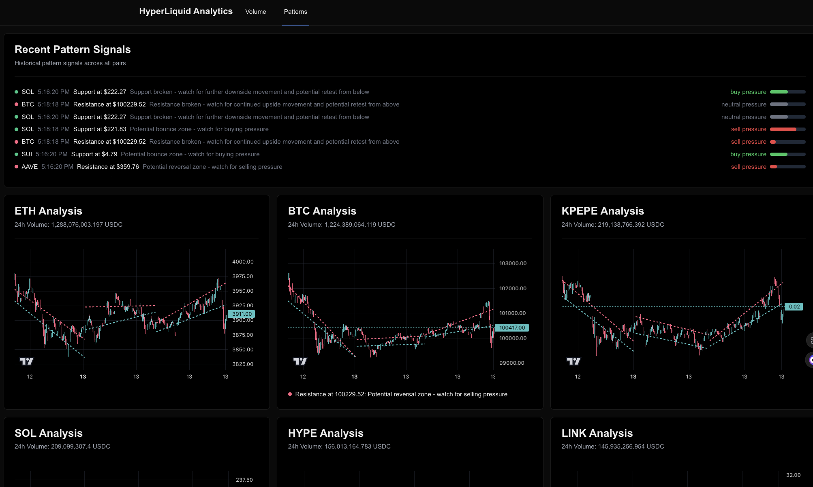

# Crypto Trading Analysis Platform

A real-time cryptocurrency trading analysis platform built with Next.js that provides advanced pattern detection, trendline analysis, and trading pressure indicators for the Hyperliquid exchange.



## Features

- Real-time price and trading data visualization
- Automatic trendline detection for support and resistance levels
- Live trading pressure indicators
- Pattern detection and historical pattern tracking
- WebSocket integration for instant updates
- Dark mode support

## Technology Stack

- **Frontend**: Next.js, React, TypeScript
- **Data Visualization**: Lightweight Charts
- **Real-time Data**: WebSocket API
- **State Management**: React Hooks
- **Styling**: Tailwind CSS

## Getting Started

### Prerequisites

- Node.js 16.x or later
- npm or yarn package manager

### Installation

1. Clone the repository:
```bash
git clone https://github.com/yourusername/crypto-trading-analysis.git
cd crypto-trading-analysis
```

2. Install dependencies:
```bash
npm install
# or
yarn install
```

3. Start the development server:
```bash
npm run dev
# or
yarn dev
```

4. Open [http://localhost:3000](http://localhost:3000) in your browser

## Project Structure

- `/src/app` - Next.js application pages and components
- `/src/hyperliquid` - Hyperliquid exchange API integration
- `/src/types` - TypeScript type definitions
- `/src/lib` - Utility functions and services

## Key Components

- **CandlestickChart**: Real-time price chart with trendline visualization
- **PatternHistoryRow**: Displays detected patterns and trading pressure
- **WebSocket Integration**: Real-time data streaming for prices and trades

## Contributing

1. Fork the repository
2. Create your feature branch (`git checkout -b feature/AmazingFeature`)
3. Commit your changes (`git commit -m 'Add some AmazingFeature'`)
4. Push to the branch (`git push origin feature/AmazingFeature`)
5. Open a Pull Request

## License

This project is licensed under the MIT License - see the LICENSE file for details.

## Acknowledgments

- [Hyperliquid Exchange](https://hyperliquid.xyz) for their WebSocket API
- [TradingView Lightweight Charts](https://github.com/tradingview/lightweight-charts) for charting capabilities
